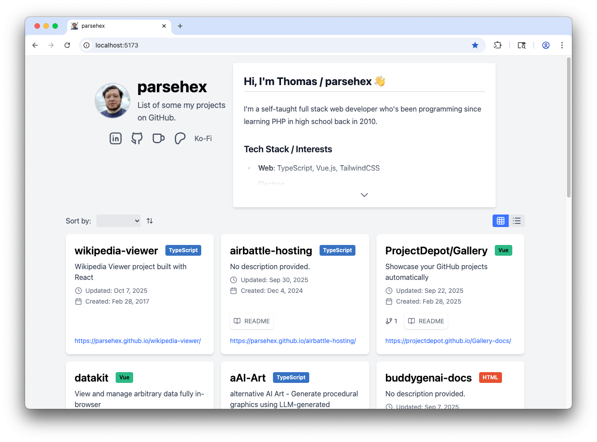
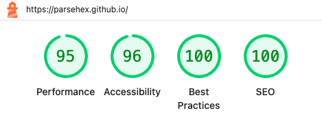

# Project Depot Gallery

> You've already created your projects -- show them off without spending more time.

A ready-to-fork project that deploys a zero-maintenance landing page to your GitHub Pages site. Your repositories are showcased and updated automatically via GitHub Actions.

## Quick Start

1. Fork this repository using the name `USERNAME.github.io`
2. Enable the GitHub Actions workflow
3. Configure GitHub Pages to deploy from the `gh-pages` branch

Done! Your portfolio will be live and updating automatically.

## Demo

I use this project for my own GitHub site, check it out here - <https://parsehex.github.io/>

### Lighthouse Score

There's always improvements to make, but we have a decent score already:

## Documentation

For detailed setup instructions, configuration options, and development information, visit the [documentation site](https://projectdepot.github.io/Gallery-docs/).

## Key Features

- **Automatic updates** via GitHub Actions – set-and-forget
- **Smart filtering** – displays repositories with homepage URLs by default
- **Fully customizable** – control which repos to show and how they appear
- **Modern UI** – built with Vue, TypeScript, and Vite

## License

Licensed under the [MIT License](LICENSE).
